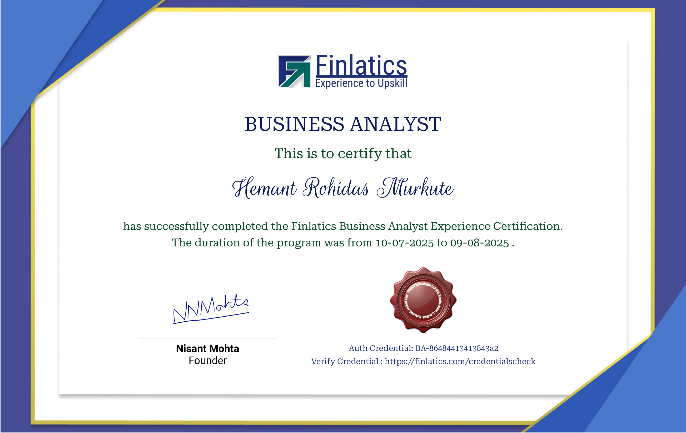
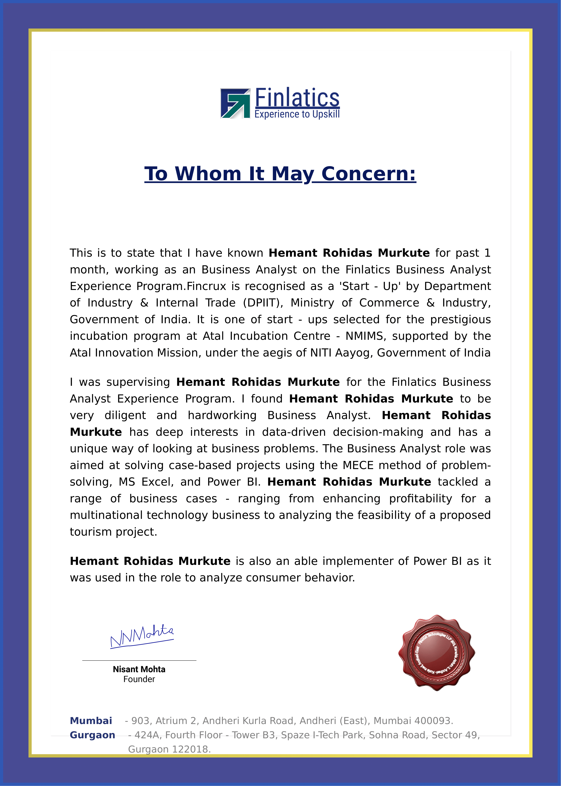

# Finlatics Business Analyst Program

This repository contains all the work completed during my **Finlatics Business Analyst Experience Program** (July 2025 – August 2025).

## 📌 Program Overview
- Duration: 1 month (10th July 2025 – 9th August 2025)
- Focus Areas: Case-based business problem solving using the MECE method, MS Excel, and Power BI.
- Verified Credential: [Click here](https://finlatics.com/credentialscheck)

## 📂 Repository Structure
- **Case_Studies/** → Detailed reports of business cases worked on.
- **Datasets/** → Data files (Excel/CSV) used for analysis.
- **Notes/** → Program notes and learnings.
- **Projects/** → Dashboards, analysis files, and final outputs.
- **Certificate & LOR** → Proof of completion and Letter of Recommendation.

## 🛠 Tools & Techniques
- **Microsoft Excel** – Data cleaning, analysis, and visualization
- **Power BI** – Interactive dashboards and data storytelling
- **MECE Method** – Structuring problem-solving
- **Data-Driven Decision Making**

## 📊 Projects Highlights
1. **Profitability Enhancement** for a multinational technology business.
2. **Feasibility Analysis** for a proposed tourism project.
3. **Consumer Behavior Analysis** using Power BI.

## 🎯 Skills Gained
- Business case analysis
- Data visualization
- Problem structuring
- Feasibility & profitability analysis
- Consumer behavior analytics

---

## 📜 Certificate

## 📝 Letter of Recommendation

